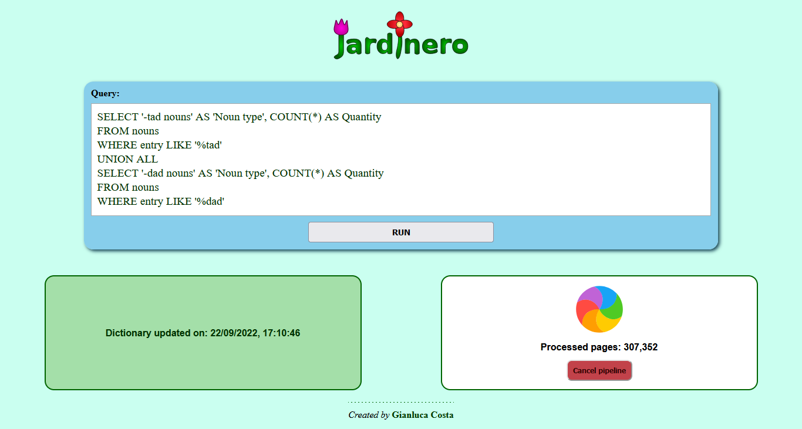

# JardineroJS

_Extensible web stack in TypeScript for exploring natural languages_


[](https://badge.fury.io/js/@giancosta86%2Fjardinero)
[](/LICENSE)



🌹**JardineroJS** is a web architecture, based on **NodeJS**, focused on _building SQL-based dictionaries_ for the _analysis of natural languages_.

It is entirely written in **TypeScript**, with a frontend enabling users to:

- create subsequent versions of _custom dictionaries_, by _extracting terms_ from a set of arbitrary _input pages_ - such as Wiktionary - and storing the data into _SQLite databases_

- perform _sophisticated queries_, in order to explore a wide variety of linguistic aspects of the newly-created dictionary - especially in the domain of _morphology_

The architecture is designed to be fully extensible - via **plugins**, that are responsible for defining:

- how to _extract terms_ from an _arbitrary source_

- how to insert the terms into _SQL tables_ - and how to retrieve them: every plugin has _its own SQLite database_

Furthermore, plugins can be created quite easily, via the open source [JardineroJS-sdk](https://github.com/giancosta86/JardineroJS-sdk).

## Installation

JardineroJS has been tested with NodeJS 16 LTS and NodeJS 18.

It should be installed as a **global package**; in particular:

```bash
npm install -g @giancosta86/jardinero
```

or

```bash
yarn global add @giancosta86/jardinero
```

Then, you need to ensure that the _global bin directory_ - as defined by your package manager settings - belongs to your PATH environment variable; for example, in the case of Yarn, you can find out this directory via the following command:

```bash
yarn global bin
```

After that, adding a directory to your PATH environment variable depends on your operating system - please, follow the most recent documentation.

## Running JardineroJS

JardineroJS cannot run by itself: _it requires a plugin even to start_ - because the data source, together with the related algorithms - _is provided by the plugin_.

Consequently, to run JardineroJS, you first need to _install a plugin_.

### Installing a plugin

Usually, plugins should be installed as **global libraries** - using the package manager you prefer: actually, you can even install JardineroJS via a package manager and later install its plugins via another one - the loading mechanism makes them totally unrelated.

> Plugins need to be installed only once: thereafter, you can run JardineroJS as many times as you wish

For example, to install the [CervantesJS](https://github.com/giancosta86/CervantesJS) plugin - devoted to the analysis of the **Spanish language** via Wikcionario:

```bash
npm i -g @giancosta86/cervantes
```

or

```bash
yarn global add @giancosta86/cervantes
```

Similarly, if you want to install [RayonJS](https://github.com/giancosta86/RayonJS) - the plugin for exploring the **French language** - you can run:

```bash
npm i -g @giancosta86/rayon
```

or

```bash
yarn global add @giancosta86/rayon
```

> As a matter of fact, JardineroJS only requires _the module_ exporting the plugin class - as explained in the [JardineroJS-sdk](https://github.com/giancosta86/JardineroJS-sdk) documentation: consequently, if you are a plugin developer, you only need the compiled .js files within your plugin project directory - with no need for packaging.

### Running a plugin

```
jardinero <linguistic module id>
```

where **\<linguistic module id\>** is usually _the directory of the installed package providing the plugin you want to use_.

More concretely, in both Bash and PowerShell, _if you are using Yarn_ to install plugins, you can run:

```bash
jardinero "$(yarn global dir)/node_modules/<linguistic module package>"
```

For example, to start JardineroJS after installing the **@giancosta86/cervantes** plugin for Spanish, you'll just need this command:

```bash
jardinero "$(yarn global dir)/node_modules/@giancosta86/cervantes"
```

Similarly, to run the **@giancosta86/rayon** plugin for French, you should execute this command:

```bash
jardinero "$(yarn global dir)/node_modules/@giancosta86/rayon"
```

> More technically, Jardinero only requires the _module id_ (which can be the file-system path) of the module exporting the linguistic plugin, as expected by the `resolve()` function and in the way described by the [JardineroJS-sdk](https://github.com/giancosta86/JardineroJS-sdk) project.
> In particular, if you are a plugin developer, you can simply pass the path to the compiled .js file of your plugin module, to test it before packaging.

## Developing custom plugins

Creating a plugin for JardineroJS is as easy as extending an abstract class - and documented in detail by the open source [JardineroJS-sdk](https://github.com/giancosta86/JardineroJS-sdk) project.

## A vast architecture of TypeScript projects

🌹JardineroJS is a huge architecture, consisting of several NPM packages.

You are invited to explore them - because they manage to be fairly general-purpose, and they are also thoroughly tested.

The complete list of the remanining NPM packages in the JardineroJS architecture is as follows:

- [CervantesJS](https://github.com/giancosta86/CervantesJS)

- [RayonJS](https://github.com/giancosta86/RayonJS)

- [JardineroJS - SDK](https://github.com/giancosta86/JardineroJS-sdk)

- [Jardinero - Frontend](https://github.com/giancosta86/jardinero-frontend)

- [stream-utils](https://github.com/giancosta86/stream-utils)

- [wiki-transform](https://github.com/giancosta86/wiki-transform)

- [worker-transform](https://github.com/giancosta86/worker-transform)

- [sqlite-writable](https://github.com/giancosta86/sqlite-writable)

- [worker-agent](https://github.com/giancosta86/worker-agent)

- [flatten-transform](https://github.com/giancosta86/flatten-transform)

- [format-error](https://github.com/giancosta86/format-error)

- [unified-logging](https://github.com/giancosta86/unified-logging)

- [typed-env](https://github.com/giancosta86/typed-env)

For convenience, a workspace file for VS code - [JardineroJS](./JardineroJS.code-workspace) - is provided within the project folder and contains the relative paths, matching the GitHub naming, of all the projects within the architecture.

## Further references

If you wish, please feel free to have a look at the original [Python edition](https://github.com/giancosta86/Jardinero) as well.
